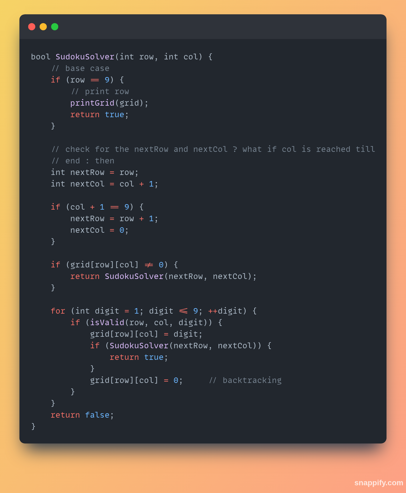

## Backtracking  

**Backtracking is a strategies for finding a solution to a problem.**  

_Backtracking is used to solve those type of problems or specific problems which have more than one possible solutions and we want all the solutions, then we'll use backtracking._   

**Example Problems :**  
1. [N-Queen](#1-n-queen)
2. [Permutation](#2-permutation)
3. [Grid Ways](#3-grid-ways)
4. [Rat In A Maze](#4-rat-in-a-maze)
5. [Sudoku Solver](#5-sudoku-solver)
6. [Find Subsets](#6-find-subsets)
7. [K-Nights Problem](#7-knight-problem)  
and many more...   

**In above all the example, they have more then one solutions. And also we can apply _bounding conditions_ to get some specific solution or desired solutions**  

**Basically _backtracking_ means we'll try to find all the possible solutions and if we stuck while getting any solution then we get back to previous step and try a different approach to solve the problem.**  

### 1. N-Queen  

_In N-Queen problem we have **N * N** matrix and we have **N** queens, so we have to set the queens in such a way that no-one queen can in war directly with each other._  

**Queen Move :**  

_Queen can move **column-wise (Same Column)**, **row-wise (Same Row)**, **diagonal** or **cross-diagoonal.**_  


**In this image, there is 4 Queens and the dimention of the chess-board [Matrix] is also 4 x 4.**  

**_the queens are placed in such a way that no any other queens can be direct in war with another queen_**  

**Here is the another image, how actually the Queens are placed and how it make a stack trace.**  

  

**For more information about _Backtracking_, you can also refer some of links which is mention below.**  

1. [Google Developers N-Queens](https://developers.google.com/optimization/cp/queens)

2. [Geeks For Geeks N-Queen](https://www.geeksforgeeks.org/dsa/n-queen-problem-backtracking-3/).

3. [Wikipedia - N-Queen Puzzel](https://en.wikipedia.org/wiki/Eight_queens_puzzle)  


**Leet Code Problem**  
1. [N-Queen Problem](https://leetcode.com/problems/n-queens/description/)  

**Let's Design The Algorithm For N-Queen Problem Using Backtracking.**  

**Step 1**  
_We should have a **isValid(int, int)** function that takes two input and it checks **queen's positions, means** they are under attack or not_   

**Step 2**  

_We should have a function **NQueen(int)** & it has only onw argument where it takes number of queens as input & perform the task for arranging the queens in each row_  

**Hint : Number Of Rows == No Of Queens**  

```cpp
bool isvalid(int k, int l) {
    for (int i = 1; i< k; ++i) {
        if (ans[i] == l || Math.abs(ans[k]-l) == Math.abs(i-k)) {
            return false;
        }
    }

    return true;
}
```

```cpp

Algorithm NQueen(int n) {
    for (int i = 1; i<= n; ++i) {
        if (isValid(n, i)) {
            ans[n] = i;
            if (n == size) {
                printAns(ans);  // if queen reaches end
                return; // do nothing
            }
            NQueen(n+1);
        }
    }
}
```
### There are three variations of _N-Queen_ question.  
1. **Find answer exist or not return _true / false_**
2. **Print all possible solutions**
3. **Count of all possible solutions**  

### Solution For NQueen Question In Cpp

**_time complexity : O(n!)_**

**This solution is for storing the safe positions were the queens are placed in answer array.**  
**Similarly we can also solve this question in two other ways, like just return `true or false` if problem exist or not or another is we can print all the possible solution.**  
```cpp
#include <iostream>
#include <vector>
#include <math.h>
using namespace std;

// let board size = 4
const int N = 4;

// now for storing queen's positons
vector<int> answer(N);

void printAns(vector<int> &answer) {
    for (int i = 0; i < answer.size(); ++i) {
        cout << answer[i] << " ";
    }
    cout << "\n";
}

/**
 * Now for solving the question we should have two function
 *      1. for recursive calling the NQueen() funtion for next call
 *      2. another for checking the valid position for keeping the queens
 */

// isSafe(int row, int col), this function check if the queen is placing in the safe place or not

bool isSafe(int row, int col) {
    for (int i = 0; i < row; ++i) {
        // using this we can check the queen moves
        if (answer[i] == col || abs(i-row) == abs(answer[i]-col)) {
            return false;   // if the queen is not safe
        }
    }
    return true;    // if the queen safe
}

// NQueen(k), function call the function recursively for placing next queen

void NQueen(int k) {
    // base case
    if (N == k) {
        printAns(answer);
        return;
    }

    // then
    for (int i = 0; i < N; ++i) {
        if(isSafe(k, i)) {
            answer[k] = i;
            NQueen(k+1);
        }
    }
}

int main() {
    NQueen(0);
    return 0;
}
```

## 2. Permutation  

**Arrangment of laters in specific orders.**   

Example :  
Suppose you have 3 letters: A, B, and C.  
All possible permutations of these 3 letters (arrangements without repetition) are:  
 * ABC
 * ACB
 * BAC
 * BCA
 * CAB
 * CBA  

So, there are 6 **permutations** of the 3 items. This is calculated by.  

**Number of permutations = 3! = _3 x 2 x 1_ = 6**  

**General Formula :**  
For n different items, the number of permutations (arrangements of all items) is : **_P(n) = n!_**  

If we are choosing and arranging **r** items out of **n**, then it is :  $P(n, r) = \frac{n!}{(n - r)!}$  

**Here is the C++ Code For Permutation:**  
**Solution Approach One**  
```cpp
void Permutation(string str, string ans) {
    int n = str.size();
    if (n == 0) {
        cout << ans << endl;
        return;
    } else {
        for (int i = 0; i < n; ++i) {
            char ch = str[i];
            string nextStr = str.substr(0,i) + str.substr(i+1, n-i-1);
            Permutation(nextStr, ans + ch);
        }
    }
}

int main() {
    string str = "abc";
    string ans = "";

    Permutation(str, ans);
    return 0;
}
```

**Solution approach 2**  
```cpp
#include <iostream>
#include <string>
#include <vector>
using namespace std;

string str = "ABC";
string ans = "";
int N = str.size();
vector<bool> selected(N, false);

void Permutation2(int k) {
    if (k == N) {
        cout << ans << endl;
        return;
    }

    for (int i = 0; i < N; ++i) {
        if (selected[i] == false) {
            ans += str[i];
            selected[i] = true;
            Permutation2(k+1);
            selected[i] = false;    // backtrack
            ans.pop_back();     // backtrack
        }
    }
}

int main() {
    Permutation2(0);
    return 0;
}
```
**Solution Approach 3**  
We can also solve `Permutation` if there is any **Bounding Coundition**  
`Bounding Condition :` means that if two consecutive letter are not allowed like `AB` & `BC` but `BA` & `AC` is allowed.  
**example:**  
_In our example we have to write a **permutation function** such a way that two consecutive characters should not be there in the result_  
**Solution Code :**  
```cpp
string str = "ABC";
int N = str.size();
string res = "";
vector<bool> select(N, false);

void Permutation_Bounding(int k) {
    if (k == N) {
        cout << res << endl;
        return;
    }

    for (int i = 0; i < N; ++i) {
        if (select[i] == false) {
            // bounding condition here
            if (k > 0 && str[i] - res.at(k-1) == 1)
                continue;
            
            res += str[i];
            select[i] = true;
            Permutation_Bounding(k+1);
            select[i] = false;
            res.pop_back();
        }
    }
}
```
## 3. Grid Ways  

_We have a matrix of size **N*M** and we have to find the total no of ways from sourse **(0,0)** to **(N-1, M-1)**_  
**Solution Approach :**  
**Allowed Moved :** _Right & Down_  

If we move right means that we are moving in the column means **col+1** and if we move towards down means that we are moving in the row, means **row+1**  

**Solution Code :**  
---  
```cpp
int PossibleWays(int row, int col, int N, int M) {
    // base case 
    if (row == N-1 || col == M-1) {  // means we are at destination
        return 1;
    }

    if (row >= N || col >= M) { // it will stop for moving infinite right or down moves
        return 0;
    }

    // right move
    int way1 = PossibleWays(row, col+1, N,M);

    // down move
    int way1 = PossibleWays(row, col+1, N,M);

    return way1 + way2;
}
```

Using **Permutation formula** we can also solve this problem .  

$$Grid(N,M) = \frac{(N+M)!}{N! \cdot M!}$$  

```cpp
int fact(int n) {
    if (n <= 1) {
        return 1;
    }

    return n * fact(n-1);
}

int PossibleWays(int N, int M) {
    int ans = fact (N-1 + M-1) / (fact(N-1) * fact (M-1));
    return ans;
}
```

## 4. Rat In A Maze  

You are given a square `N x N` **matrix**, **maze**, where each cell represents a part of a maze. A value of `1` in a cell `maze[i][j]` indicates that the block is open and the rat can move to it. A value of 0 indicates that the block is a wall, and the rat cannot move there.  
A rat starts at the source cell at `(0, 0)` and must reach the destination cell at `(N-1, N-1)`.  

**Rules for RAT movement**  
* The rat can only move one step at a time in four possible directions: Up, Down, Left, and Right.  
* A move is only valid if it is to an open cell (a cell with value 1).  

_Our task is to find all the possible path to reach the destination_  
**Here is a maze that shows how the rat moves**  
**The maze is size of 4 * 4**

  
_The **gray cells** display that rat cannot moves in that cells and the **white cells** display that rat can move into that_   

**Here is the solution path for rat**  

  
**_output for this maze is: DRDDRR_**  

**_Solution Code_**  
```cpp
#include <iostream>
#include <vector>
using namespace std;

// in this solution we are considering some of the global vactors and variables.

// in our solution we'll getting all the possible paths 'row & col' as well as we are printing the direction as well .

// means we have two solution
// 1. In a 2D matrix where we store solution row at solution[0] and col at solution[1] . Means that in the solution matrix we have only two rows and N paths (columns). 

const int MAZE_SIZE = 4;
int path = 0;   // for tracking the solution in 2D matrix
int POSSIBLE_SOLUTION = MAZE_SIZE * MAZE_SIZE;
vector<vector<int>> SOLUTION(2, vector<int>(POSSIBLE_SOLUTION));

// now we can also declare a global vector for creating a maze where 0 means block and 1 means open

vector<vector<int>> MAZE = {
    {1,0,0,0},
    {1,1,0,1},
    {0,1,0,0},
    {1,1,1,1}
};

void findPath(int i, int j, string direction) {
    // base case : when we reached the destination
    if (i == MAZE_SIZE-1 && j == MAZE_SIZE-1) {
        SOLUTION[0][path] = i;
        SOLUTION[1][path] = j;

        cout << "Solution Path In 2D Matrix: \n";
        for (int row = 0; row < 2; ++row) {
            for (int col = 0; col <= path; ++col) {
                cout << SOLUTION[row][col] << " ";
            }
            cout << endl;
        }

        cout << direction << endl; // also print the direction : example : DDRRDDLL
        cout << "-------------------------\n";

        return;
    } else {
        // now in this code section deside how actually the rat move in all 4 directions

        // first mark the cell as visited
        MAZE[i][j] = 0;

        // now store the solution
        SOLUTION[0][path] = i;
        SOLUTION[1][path] = j;
        // increase the path for tracking the solution
        path++;

        // now we have to check the moves 
        // right moves
        if (j+1 < MAZE_SIZE && MAZE[i][j+1] == 1) {
            findPath(i, j+1, direction+"R");
        }

        // down move
        if (i+1 < MAZE_SIZE && MAZE[i+1][j] == 1) {
            findPath(i+1,j, direction+"D");
        }

        // left move
        if (j-1 >= 0 && MAZE[i][j-1] == 1) {
            findPath(i, j-1, direction+"L");
        }

        // up move
        if (i-1 >= 0 && MAZE[i-1][j] == 1) {
            findPath(i-1, j, direction+"U");
        }

        // now after all the direction if there is no path then backtrack and mark the cell as open
        MAZE[i][j] = 1;
        // and also reduce the solution by path-- so the solution will delete from SOLUTION
        path--;
    };
}

int main() {
    string direction = "";
    findPath(0,0, direction);  // rat start from (0,0);
    return 0;
}
```  
**_Code Output :_**  

```
Solution Path In 2D Matrix: 
0 1 1 2 3 3 3 
0 0 1 1 1 2 3 
Solution In Directions : DRDDRR
---------------------------------
```
**Time Complexity :** _The algorithm calling it-self in 4 directions for each cell, so it is_ $4 * N^2$ _means it is_  $O(N^2)$

_And if suppose the maze is completly blank means that there is no blocks in the maze, all the cells are open then in this condition all the possible conditions are true so **time complexity will be :**_  $4^{N * N}$

## 5. Sudoku Solver  

In this section we're discussion an important and classic `backtracking` problem that is **Sudoku Solver**. This problem takes partially filled `9x9` Sudoku grid and return the completly solved grid, adhering to all the rules of the game.  

**Problem Description**  
Sudoku is a logic-based number-placement puzzle. The objective is to fill a `9x9` grid with digits so that **each column**, **each row**, and **each of the nine 3x3 subgrids** that compose the grid contain all of the digits from __1 to 9__.  

_The puzzle starts with a partially filled grid, which for a well-posed puzzle has a single unique solution._  

**Rules**  
A Sudoku puzzle is solved when the following conditions are met:
1. **Row Constraint:** Each of the nine rows must contain the digits from _1 to 9_ exactly once.  
2. **Column Constraint:** Each of the nine columns must contain the digits from _1 to 9_ exactly once.  
3. **Subgrid Constraint:** Each of the nine 3x3 subgrids must contain the digits from 1 to 9 exactly once.  

**Input and Output**  

**Input:** A 9x9 integer matrix (or a 2D array) representing the Sudoku board. Empty cells are typically represented by the number `0`.  

**Output:** A 9x9 integer matrix representing the solved Sudoku board.  

**Algorithm Approach**  
This problem is a classic example that can be solved efficiently using a backtracking algorithm. The basic idea is to recursively try placing digits from 1 to 9 in an empty cell. If a digit placement violates the Sudoku rules, we backtrack and try the next digit. If all digits have been tried and none work, we return to the previous cell and change its value. This process continues until the entire grid is filled correctly.  

_The most common algorithm for solving Sudoku is backtracking. It's a recursive, depth-first search approach that systematically tries to fill in the empty cells._  
1. **Find an Empty Cell:** Scan the board (e.g., from left-to-right, top-to-bottom) to find the next empty cell. If no empty cells are found, the puzzle is solved, and you can return true.  
2. **Try Numbers (1-9):** For the found empty cell, iterate through numbers 1 to 9.  
3. **Check for Validity:** For each number, check if placing it in the current empty cell is valid. A placement is valid if the number does not already exist in:
    * **The Current Row** 
    * **The Current Column**
    * **The Current 3x3 Subgrid**  
4. **Recursion:**  
    * If the number is `valid`, place it on the board and recursively call the solver function on the updated board.  
    * If the recursive call returns `true` (meaning it led to a complete solution), then you've found the solution. Return `true` up the call stack.  

5. **Backtrack**  
    * If the recursive call returns `false` (meaning the number placed did not lead to a solution), you must backtrack. Reset the current cell back to empty (e.g., `0`) and try the next number in the loop (from step 2).  

6. **End of Loop:** If you have tried all numbers from 1 to 9 for the current cell and none of them resulted in a solution, return false to the previous recursive call. This signals that a wrong move was made earlier in the process.  

**Example Code Solution:**  
_Here is an solution code for sudoku solver_  
```cpp
// printing the grid
void printGrid(vector<vector<int>> &grid) {
    for (auto &row : grid) {
        for (int cellValue : row) {
            cout << cellValue << " ";
        }
        cout << endl;
    }
}
```

___Here is the code snap for solution___  
**Checking validation :**  

<!--    -->


___SudokuSolver Function___  

 

__From main Function__  

```cpp
int main() {
    cout << "Before : \n";
    printGrid(grid);

    cout << "After : \n";
    SudokuSolver(0,0);
    return 0;
}
```
**Time Complexity**  
For each location (cell) it check from 1 to 9 and there are 81 cells means total $9^2$ cells are there.  
**We have n = 9, then**
_Wrost Case Time Complexity Is_ $9 ^{n^2}$ or $n^{n^2}$ 

**Space Complexity: O(m)**  
* The space complexity is determined by the depth of the recursion stack. In the worst case, the recursion can go as deep as the number of empty cells, m. Therefore, the space required is proportional to `m`.  

## 6. Find Subsets  

## 7. KNight Problem  
