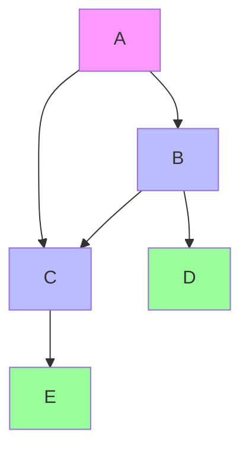
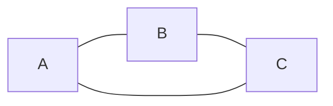
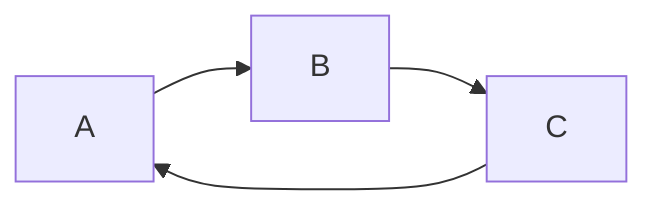
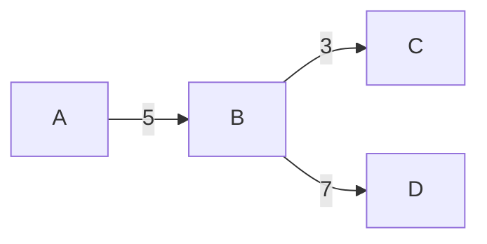
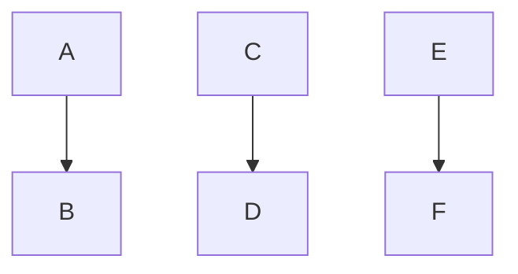
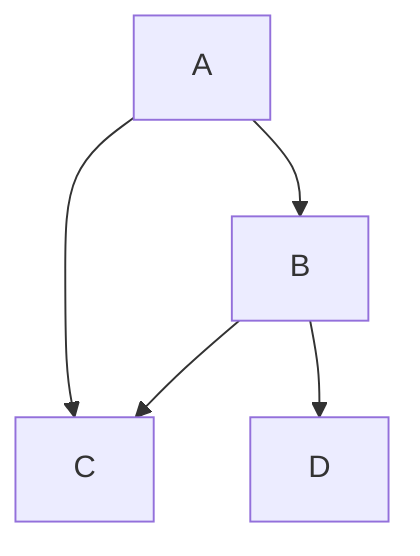
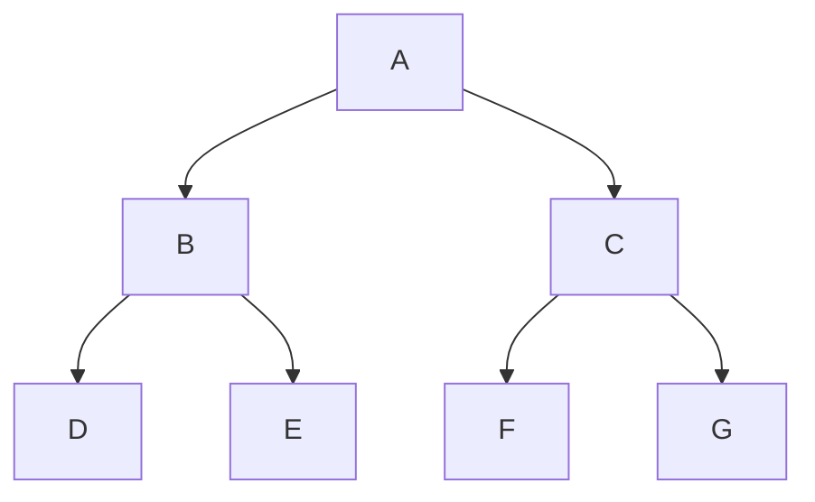
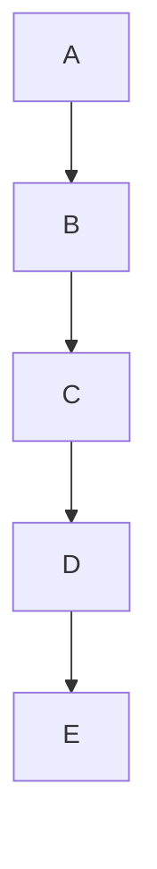

# 🌐 Graph Data Structure — Complete Visual Guide

*A non-linear data structure that models relationships between objects*  

### 🎯 What is a Graph?

A Graph is a powerful data structure that represents connections between entities. Think of it like a social network where people are connected by friendships, or a map where cities are connected by roads.  

**Mathematical Definition**  
G = (V, E)  

-   **V = Set of vertices (nodes)** - the entities
-   **E = Set of edges (connections)** - the relationships  

### 🧩 Visualizing Graph Components  


| Component         | Visual    | Description                                   |
| :---------------- | :-------- | :-------------------------------------------- |
| **Vertex/Node** | `(A)`     | Represents an entity (person, city, computer) |
| **Edge/Connection** | `A---B`   | Represents relationship between two vertices  |  

## 📊 Graph Types & Classification  

### 1. 🔄 Based on Direction

**Undirected Graph**  


-   **Edges have no direction**
-   Relationship is mutual (like Facebook friendships)
-   Example: `A--B` means A is connected to B AND B is connected to A  

**Directed Graph (Digraph)**  

-   **Edges have direction**
-   Relationship is one-way (like Twitter follows)
-   Example: `A→B` means A follows B, but B may not follow A

### 2. ⚖️ Based on Weights  

**Unweighted Graph**  
```mermaid
graph LR
    A -- B -- C
```
-   All edges are equal
-   Just care about connectivity  

**Weighted Graph**  


-   Edges have values (distance, cost, time)
-   Used in navigation systems

### 3. 🔗 Based on Connectivity  
**Connected Graph**  

-   Every vertex is reachable from every other vertex
-   No isolated components

**Disconnected Graph**  


-   Has **separate components**
-   Some vertices cannot reach others

## 🗂️ Graph Representation Methods  

### 1. 📊 Adjacency Matrix  

**Visual Representation:**  
```
    A  B  C  D
A  [0, 1, 1, 0]
B  [1, 0, 1, 1]  
C  [1, 1, 0, 0]
D  [0, 1, 0, 0]
```  

**Graph Structure:**  

| Aspect | Details |
| :--- | :--- |
| **Space** | $O(V^2)$ - uses more memory|
| **Edge Lookup** | $O(1)$ - very fast|
| **Best For** | Dense graphs with many edges|


### 2. 📝 Adjacency List  
**Visual Representation:**  
```
A → [B, C]
B → [A, C, D]  
C → [A, B]
D → [B]
```  

**Graph Structure:**  

| Aspect        | Details                               |
| :------------ | :------------------------------------ |
| **Space** | $O(V + E)$ - memory efficient         |
| **Edge Lookup** | $O(\text{degree})$ - depends on connections |
| **Best For** | Sparse graphs, most real-world cases  |  

## 🧭 Graph Traversal Algorithms  

### 1. 🟡 Breadth-First Search (BFS) - Level by Level  
**Traversal Order:**  



**Algorithm:**  
```cpp
void BFS(int start) {
    queue<int> q;
    vector<bool> visited(V, false);
    
    q.push(start);
    visited[start] = true;
    
    while (!q.empty()) {
        int current = q.front();
        q.pop();
        cout << current << " ";
        
        for (int neighbor : adj[current]) {
            if (!visited[neighbor]) {
                visited[neighbor] = true;
                q.push(neighbor);
            }
        }
    }
}
```  

**Use Cases:** Shortest path in unweighted graphs, social network degrees  

### 2. 🔴 Depth-First Search (DFS) - Go Deep First  
**Traversal Order:**  


**Algorithm:**  
```cpp
void DFS(int node, vector<bool>& visited) {
    visited[node] = true;
    cout << node << " ";
    
    for (int neighbor : adj[node]) {
        if (!visited[neighbor]) {
            DFS(neighbor, visited);
        }
    }
}
```  
**Use Cases:** Cycle detection, path finding, maze solving  

### 💻 Complete C++ Implementation  
```cpp
#include <iostream>
#include <vector>
#include <queue>
#include <list>
using namespace std;

class Graph {
private:
    int V;                    // Number of vertices
    vector<list<int>> adj;    // Adjacency list

public:
    // 🏗️ Constructor
    Graph(int vertices) {
        V = vertices;
        adj.resize(V);
    }

    // ➕ Add Edge (undirected by default)
    void addEdge(int u, int v, bool directed = false) {
        adj[u].push_back(v);
        if (!directed) {
            adj[v].push_back(u);  // Bidirectional for undirected
        }
    }

    // 🖨️ Print Graph Structure
    void printGraph() {
        cout << "📊 Graph Adjacency List:" << endl;
        for (int i = 0; i < V; i++) {
            cout << "Vertex " << i << " → ";
            for (int neighbor : adj[i]) {
                cout << neighbor << " ";
            }
            cout << endl;
        }
    }

    // 🟡 BFS Traversal
    void BFS(int start) {
        cout << "🟡 BFS Traversal: ";
        vector<bool> visited(V, false);
        queue<int> q;
        
        q.push(start);
        visited[start] = true;
        
        while (!q.empty()) {
            int current = q.front();
            q.pop();
            cout << current << " ";
            
            for (int neighbor : adj[current]) {
                if (!visited[neighbor]) {
                    visited[neighbor] = true;
                    q.push(neighbor);
                }
            }
        }
        cout << endl;
    }

    // 🔴 DFS Traversal
    void DFS(int start) {
        cout << "🔴 DFS Traversal: ";
        vector<bool> visited(V, false);
        DFSUtil(start, visited);
        cout << endl;
    }

private:
    void DFSUtil(int node, vector<bool>& visited) {
        visited[node] = true;
        cout << node << " ";
        
        for (int neighbor : adj[node]) {
            if (!visited[neighbor]) {
                DFSUtil(neighbor, visited);
            }
        }
    }
};

// 🧪 Example Usage
int main() {
    // Create graph with 5 vertices
    Graph g(5);
    
    // Add edges (undirected)
    g.addEdge(0, 1);
    g.addEdge(0, 4);
    g.addEdge(1, 2);
    g.addEdge(1, 3);
    g.addEdge(1, 4);
    g.addEdge(2, 3);
    g.addEdge(3, 4);
    
    // Display and traverse
    g.printGraph();
    g.BFS(0);  // Start BFS from vertex 0
    g.DFS(0);  // Start DFS from vertex 0
    
    return 0;
}
```  
**Output:**  
```
📊 Graph Adjacency List:
Vertex 0 → 1 4 
Vertex 1 → 0 2 3 4 
Vertex 2 → 1 3 
Vertex 3 → 1 2 4 
Vertex 4 → 0 1 3 

🟡 BFS Traversal: 0 1 4 2 3 
🔴 DFS Traversal: 0 1 2 3 4 
```  

## 🎯 Real-World Applications  

| Domain              | 🎯 Graph Usage           | 📱 Example           |
| :------------------ | :----------------------- | :------------------- |
| **Social Networks** | Friend connections       | Facebook, LinkedIn   |
| **Transportation** | Road networks            | Google Maps, Uber    |
| **Web** | Page links               | Google Search        |
| **Computer Networks** | Network topology         | Internet routing     |
| **Recommendations** | User-item connections    | Amazon, Netflix      |

## 📊 Quick Comparison Table  

| Feature        | 📊 Adjacency Matrix | 📝 Adjacency List |
| :------------- | :------------------ | :---------------- |
| **Space** | $O(V^2)$            | $O(V + E)$        |
| **Add Edge** | $O(1)$              | $O(1)$            |
| **Check Edge** | $O(1)$              | $O(\text{degree})$|
| **Memory** | High                | Low               |
| **Best For** | Dense graphs        | Sparse graphs     |

## 🚀 Key Takeaways 
-   **Graphs model relationships** between entities
-   **Choose representation** based on your use case
-   **BFS** for shortest paths, **DFS** for deep exploration  
-   **Real-world graphs** are usually sparse → prefer adjacency lists

## 🔗 Additional Resources  
-   [Graph Theory](https://en.wikipedia.org/wiki/Graph_theory)
-   [GeeksforGeeks Graph Data Structure](https://www.geeksforgeeks.org/graph-data-structure-and-algorithms/)
-   [Visualgo Graph Visualization](https://visualgo.net/en/graphds)

**⭐ Star this repo if you found it helpful!**  
*Graphs are everywhere! 🌍 From your social media friends to website links and transportation networks.*