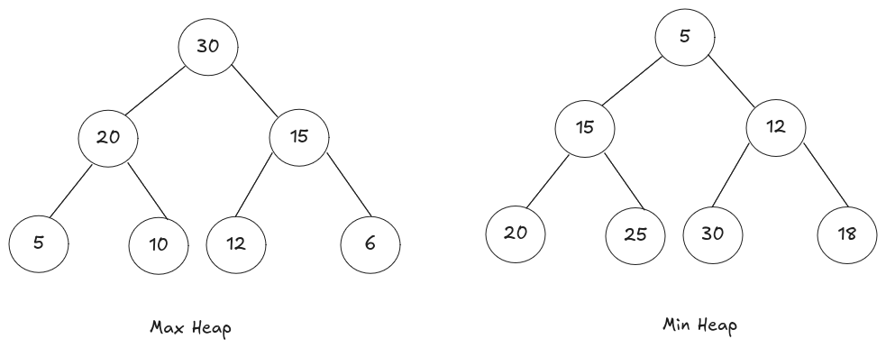

# Heap / Priority Queue  

Based upon some condition whenn we have to sort or select something at that moment we can use priority queue.  

**e.g:**  *In some condition, we have to find minimum / maximum element among a collection of element.*  

***Note*** : **A priority queue is a data structure that support operations, like insert, deleteMin, getMaximum, getMinimum, etc.**  

**Application Of Priority Queue:**  
-   **Main Operations**
    - insert(val) : Inserting a value .
    - deleteMin, deleteMax : deleting min & max
    - getMin, getMax : getting max & min value

-   **Auxilary Operations**  
    - kth smallest / largest number.
    - size of the priority queue
    - heap sort

***Note:*** In priority queue, the heighest value will always on the top of the queue and rest element can be present randomly.  

**Heap is implemented using priority queue**  

## Heap  

Heap is a complete binary tree and if the elements are represented in an array then there should not any blank space between the elements.  

**Heap**
-   max heap : The value of root always greater then it's decendent. 
-   min heap : The value of root always smaller then it's decendent.

