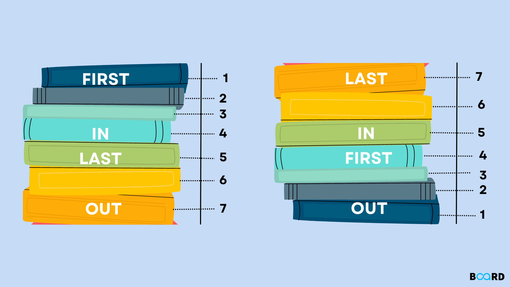

# Stack Data Structure  

A Stack is a data structure this is used to store information or data similar to linked list . The order in which data inserted and deleted from stock is important .  

Stack uses **LIFO** *(Last-In-First-Out)* or **FILO** *(First-In-Last-Out)* .  

**Example:**  
The plates are added to the stack as they are cleaned . 

**Important Terms That Are Used In Stack:**  
**_Followings are the main operations in stack_**
1. push : _This means you are adding some value or information to stack_
2. pop : _This means you are deleting some value or information from stack_
3. underflow : _This means you are trying to delete a value or information from stack but the stack is already empty_
4. overflow : _This means you are trying to adding a value or information to stack but the stack is already full_  

**_Auxilary Operations_**
1. top : _Getting the first value from stack_
2. size : _What is the size of the stack_
3. isEmpty : _Check if the stack is empty or not_
4. isFull : _Check if the stack if full or not_  

