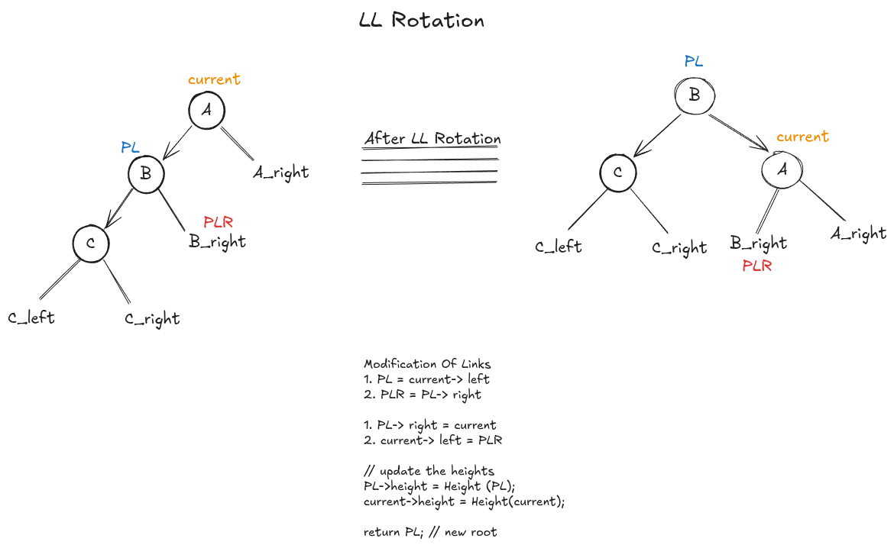

# AVL Trees  

AVL Trees are the height balance binary search trees, means it balance the height of a binary search tree.  
AVL trees are balanced using balance factor .  

_for every node we are calculating the height_  
_Balance factor of a node always belong to {-1, 0 1}, It cannot be more then that, if any node having balance factor > 1 or < -1, means that, node is unbalanced ._  

_And for balancing that node we are performing rotations. There are four types of rotations in AVL Trees ._ 
-   **_[LL Rotation](#ll-rotation)_**
-   **_[LR Rotation](#lr-rotation)_**
-   **_[RR Rotation](#rr-rotation)_**
-   **_[RL Rotation](#rl-rotation)_**  

**_Note_** : For calculating the balance factor there is a simple formula : 
-   **balance_factor =** $height_left - height_right$ ∈ `{-1, 0, 1}`
-   if balance_factor = |height_left - height_right| <= 1 && >= -1 means that `Node is balance` . 
-   if balance_factor = |height_left - height_right| > 1 means that `Node is unballanced` .  

**_Note_** : Balance factor of a node cannot be more that > 2 or < -2 . The balance factor always lies between -2 to 2 and the rotation always berform between three nodes only, no matter, how big the tree is . If there is 10000 nodes, still the rotation is performing betwee three nodes .  

### Here is `how to calculate height and balance factor for each node` :  

**Height At Each Node**  
```cpp

int getHeight (Node *node) {
    return node ? node->height : 0;
}

int Height(Node *current) {
    return 1 + max(getHeight(current->left), getHeight(current->right));
}
```

**Calculate The Balance Factor**  
```cpp
int balance_factor (Node *current) {
    // hl = height of left sub-tree
    // hr = height of right sub-tree
    int hl = current && current->left ? current->left->height : 0;
    int hr = current && current->right ? current->right->height : 0;

    return hl > hl - hr;
}
```
  
### LL Rotation  

When the balance factor of a node is +ve 1, means that the tree is balance in the left tree, so we can perform `LL Rotation` .  


_[See the LL Rotation Implementation](./avl_tree.cpp)_  

### LR Rotation  

When the balance factor of a node is and +ve 1 and it's right child's balance factor is -1, means there is Left - Right Unballanced.  


_[See the LR Rotation Implementation](./avl_tree.cpp)_


### RR Rotation  

### RL Rotation  