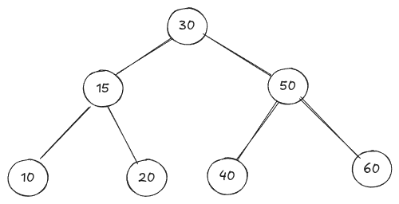

# Binary Search Tree (BST)  

In binary search tree, for every node all the elements in it's left sub-tree are smaller than that node and all the elements in the right sub-tree are greated than that node.  

_Bianry trees are useful for searching. Because the binary tree, usually takes $O(logn)$ time, for searching_  

  

### Important Functions In Binary Search Trees  
-   **[insert]()**
-   **[search]()**
-   **[inorder predecessor]()**
-   **[inorder successor]()**
-   **[count]()**
-   **[height]()**
-   **[delete]()**
-   **[sum]()**
-   **[mininum]()**
-   **[maximum]()**
-   **[duplicated]()** 
