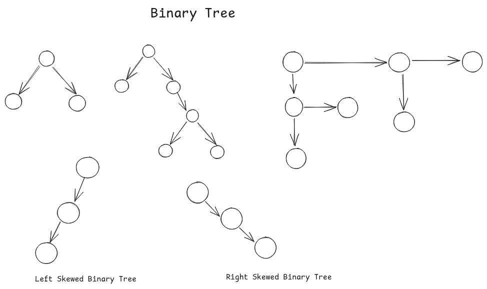

# Tree Data Structure  

A **tree** is a collection of `nodes` and `edges` and one of the node is selected as _**root node**_ and rest all the nodes are divided into disjoint subsets and each subset is a tree or sub-tree .  


### Terminology Of A Tree  

1   ***root***  : _The topmost node of the tree_ . 

-   _e.g `A` in the above tree_ .

2   ***parent*** : A parent node is a node in which one or more than one node is connected to it . 

-   _e.g `B` is the parent of node `E` and node `F`_

3   ***child*** : A child node is a node that is directly connected to another node, which is called it's parent .

-   _e.g node `E` is the child of `B` ._

4   ***siblings*** : _The siblings are the direct child of a parent node, or in other word the sibling node share same parent node_ . 

-   _e.g node `E` and node `F` are the siblings and both have same parent node `B`_ .

5   ***descendant*** : _A descendant of a node is any node that can be reached by repeatedly moving from a parent to a child . This include the node's children, it's grand-children or it's great grand-childrens_ . 

-   _e.g Descendant of `B` is [`N`, `J`, `K`, `F`]_ .

6   ***ancestors*** : _An ancestor of a node is any node on the path from that node to the root_ . 

-   _e.g from node `O` to root `A`, path = [`O`, `L`, `H`, `D`, `A`]_ .

7   ***degree of node*** : _Number of direct children of a node_ . 

-   _e.g deg(`B`) = 2, because node `B` having two direct children & deg(`D`) = 3, because node `D` having 3 direct children_ .

8   ***external node / leaf node*** : _All the node which have 0 nodes, means the last generation_ . 

-   _e.g nodes `E`, `N`, `K`, `C`, `G`, `O`, `P`, `M` & `I` are the leaf node or external node bacause they don't have any child or they are not parent_ .

9   ***internal node / non-leaf node*** : _A node which have one or more than one childre_ .

-   _e.g nodes `B`, `F`, `J` `L`, `H` & `D` are the internal node, because all the nodes have either one children node or more than one or in other word, they are the parent of one or more than one children_ .

10   ***levels*** : _The level of a node is nothing but it's distance from the root . The level concept is very closely related to depth of a node_ .

-   _e.g_
-   The **root node** is at **Level 0**.
-   The children of the root are at **Level 1**.
-   Their children are at **Level 2**, and so on.

11   ***height*** : _The height is the length of the **longest path** from the **root node** to a **leaf node**. It represent the overall tallness of the tree ._ 

-   **Height Of A Node :** The height of a specific node is the length of the longest path from that node down to a leaf node in its subtree.

-   **Height of a Tree:** The height of the entire tree is the height of its root node.

12   ***forest*** : **The collection of sub-trees are nothing but a forest.**  

### [Binary Tree](./BinaryTree/binarytree.h)
_A tree where every node can have either `0`, `1` or at most `2` children nodes_ .  



**Nodes Can Be Labbeled & Unlabbeled**  

  


### Number of binary tree using nodes  
_**Unlabbled Nodes**_  
_Using unlabbled how many binary trees can be generated ?_ . **Means that if we have `n` nodes then how many binary trees can be formed ?**  

_Using a formula name as **catalon number**, we can actually find out, the number of trees can be formed if we have number of nodes_  

**example:**  _if we have `3` unlabbled nodes, then we can actually formed `5` binary trees, and if we have `4` unlabbled nodes then we can actually generate total `14` number of binary trees._  

**Formula =**   

**Here is the recursive formula =**  

_**Labbled Nodes**_  
_using labbled nodes, also if we have `n` labbled nodes, then what will be the number of binary trees can be formed ?_ . We can use the same `catalon formula` but with some modification, because every labble nodes have `n` shapes, so there will be total.  

catalon number * n!, means  
 * $N!$  

**What will be the number of trees with maximum height ?**  _for this we can use following formula_  
___No of trees with maximum heights =___ $2^{n-1}$  

### Number Of Nodes In A Binary Tree  

If we have height of a binary tree, then how many(min or max) numbers of nodes will be in the binary tree.  

-   **Minimum Number Of Nodes (N)=**  $H + 1$ _where `H` represent the given height of the tree._  
-   **Maximum Number Of Nodes (N)=**  $2^{H+1}-1$  _where `H` represent the given height of the tree._  

### Height Of A Binary Tree
If we have number of nodes, given then what will be max or min height of the binary tree .  

-   **Minimum Heigth (H)=** $\log_2 (N+1) - 1$    
-   **Maximum Height (H)=** $N-1$ _where `N` represent the number of nodes in the binary tree._  

### Internel Nodes (Non-Leaf Nodes) & External Nodes(Lead Nodes)  

In a binary tree, `deg(0)` means the external nodes, means there is no child node of a parent node .  
So the following formula is always true :  

-   `deg(2)` = A node which have 2 child nodes,  
-   `deg(0) = deg(2) + 1`  

### Strict Binary Tree  

_A strict binary tree also known as proper or complete binary tree . In strict binary tree, a node can have minimum `0` or maximum `2` child nodes_ . **either just 0 or 1 .**  

  

In the above mention image if you check, the root node `A` has 2 child nodes, `B` & `C` in the first image, where as `B` & `C` does not have any child node, means  

-   **deg(A) = 2**
-   **deg(B) = 0**
-   **deg(C) = 0**  

And again if you see the second image, which has total `5` nodes in the binary tree, in this, root node `A` has 2 child node and one of the child node `C` has `2` child nodes such as node `D` & node `E` . Hence we can say that :  

-   **deg(A) = 2**
-   **deg(B) = 0**
-   **deg(C) = 2**
-   **deg(D) = 0**
-   **deg(E) = 0**  

### No Of Nodes In Strict Binary Trees  

If we have height (H) is given then how many number of nodes will be there in the strict binary tree :  

-   **maximum no of nodes(N) =**    $2^{H+1} - 1$
-   **minimum no of nodes(N) =**    $2 \cdot H + 1$  

### Height Of A Strict Binary Tree  

If we have nodes (N) then what will be the height of the strict binary tree :  

-   **maximum height (H) =**  $\frac{N-1}{2}$
-   **minimum height (H) =**  $\log_2 (N+1) - 1$  

### Internel (Non-Lead Nodes) v/s External (Leaf Node)  

The following formula is always same, means the number of external nodes in strict binary tree is always :  

-   ___external_node (e) = internal_node(i) + 1___  


### N-Ary Trees  

_In N-Ary Trees, `N` is the degree of tree and every nodes can have at most N child nodes, not more than N ._  

Let say we have **3-ary tree**, means that every node can hace either ${0, 1, 2, or 3}$ child nodes . **_e.g_**   

  

Now, in the image, the very first image has a root node `A` and it has `3` child nodes, which are `B`, `C` & `D` and every node have capacity of 3 child nodes, but the node `B` and the node `D` have only 2 child nodes and node `C` does not even a child, _feeling bad for node `C` ._  

In the same image, if you look into the second tree, it is also a 3-ary tree, means each node have a capacity of 3 child nodes .  

### Strict N-ary Binary Tree  

In strict N-ary binary tree, every node can have either ${0 or N}$ child .  
In the above image, since the second tree is 3-ary tree, so every node has either 0 or exactly N child node, so the second tree is not following the condition of a strict binary tree, thus it is not a strict binary tree .  

### Number of nodes in strict binary tree  
If we have height of the tree, then what will be the number of nodes in the strict binary tree .  

-   **maximum number of nodes (N) =** $\frac {N^ {H+1} - 1}{N-1}$
-   **minimum number of nodes (N) =** $N \cdot H + 1$  

### Height of a strict binary tree  
If we have number of nodes, then what will be the height of the strict binary tree .  
-   **maximum height (H) =** $\frac {N+1}{N}$  
-   **minimum height (H) =** $log_N[N (N-1) + 1] - 1$  

### Internal (Leaf Node) & External (Non-Lead Node)  

In the strict binary tree, the number of external nodes is always  
-   **external_node (e)** = $(N-1) + 1$  


### Representation Of Binary Tree  

_We can represent the binary tree using `arrays` and `linked`_ . But most often **linked representation** is used to represent the binary tree .  

### Linked Representation  

In linked representation, every [node](./BinaryTree/Node.h) consist of three things, 
-   **data**
-   **pointer to leftChild**
-   **pointer to rightChild**  

```cpp
class Node {
    Node *leftChild;    // pointer to leftChild
    int data;           // data 
    Node *rightChild;   // pointer to rightChild
};
```

**_note_** : if there are `N` nodes, then there will be `N+1` null pointers.   

_refer the following link for binarytree implementation with some important functions_  
[Here is representation of binary tree](./BinaryTree/binarytree.h)