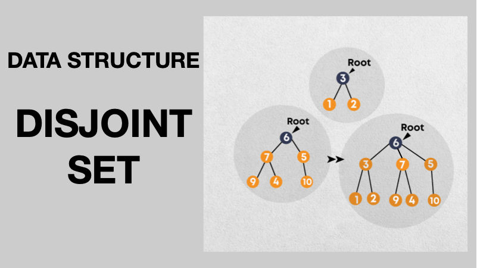

# Disjoint Set Union (DSU) / Union-Find

<div align="center">



</div> 

## Overview

A **Disjoint Set Union** (also called **Union-Find**) is a data structure that keeps track of a set of elements partitioned into a number of disjoint (non‑overlapping) subsets. It is used to efficiently answer connectivity queries (e.g., “are these two elements in the same set?”) and to merge two sets.

Common applications:
- Finding connected components in a graph.
- Kruskal’s algorithm for Minimum Spanning Tree.
- Dynamic connectivity in networks.

In this repository, we have implemented **two versions**:
1. **Naïve / Unoptimized** – simple but can be very slow.
2. **Optimized** – using **path compression** and **union by rank** – which achieves near‑constant time.

---

## Core Idea

We represent each set as a **virtual tree**:
- Each element is a node.
- Every node has a **parent** pointer.
- The **root** (representative) of a tree is its own parent.
- Two elements belong to the same set if they have the same root.

### Why trees?
Trees allow us to **find** the representative by following parent pointers up to the root. The root serves as a unique identifier for the whole set.

---

## Data Structures

We use two arrays:
- `parent[i]` – the parent of element `i`. If `parent[i] == i`, then `i` is the root.
- `rank[i]` (used in the optimised version) – an upper bound on the height of the tree rooted at `i`; helps keep trees shallow.

---

## Operations

### 1. Make Set (Initialisation)
Initially, every element is its own set: `parent[i] = i` for all `i`.

### 2. Find(x) – Find the root of the set containing `x`
- Follow parent pointers from `x` until we reach a node whose parent is itself.
- **Naïve**: `while (x != parent[x]) x = parent[x];`
- **With path compression**: during the search, we make every visited node point directly to the root, flattening the tree.

### 3. Union(x, y) – Merge the sets containing `x` and `y`
- Find the roots `rx = find(x)` and `ry = find(y)`.
- If they are the same, do nothing (they are already in the same set).
- Otherwise, make one root the parent of the other.
- **Naïve**: attach `rx` under `ry` (or vice‑versa) without any strategy.
- **With union by rank**: attach the tree with smaller rank under the larger one, increasing rank only when equal.

---

## Version 1: Unoptimized DSU

In this version, we only store `parent` and attach arbitrarily during union. There is **no path compression** and **no union by rank**.

### Implementation

```cpp
class DSU {
    vector<int> parent;
public:
    DSU(int n) : parent(n) {
        iota(parent.begin(), parent.end(), 0);
    }

    int find(int x) {
        if (x == parent[x]) return x;
        return find(parent[x]);  // no compression – can be O(N)
    }

    void unite(int x, int y) {
        int x_parent = find(x);
        int y_parent = find(y);
        if (x_parent != y_parent)
            parent[x_parent] = y_parent;  // arbitrary attach
    }
};
```  

## Complexity
* `find` can be **O(N)** in the worst case (a long chain).
* `union` is also **O(N)** because it calls `find`.
* This can become extremely slow for large N.

## Test Results (Correctness & Performance)
* All correctness tests passed (10 tests).
* Performance tests show the slowdown as N increases.  

```text
========== DSU (BASIC) TEST SUITE ==========

--- Correctness Tests ---
[✓] Basic union 0-1, 2-3
[✓] Merge components via 1-2
[✓] Union self (1,1)
[✓] Repeated union (0,1)
[✓] Chain 0-1-2-3-4-5 all connected
[✓] Complex mixed unions
[✓] Consistent roots after chain
[✓] Random unions (N=100) – no invalid roots
[✓] Construction with N=0
[✓] Single element operations

--- Performance Tests (time in milliseconds) ---

N = 1000
  Chain build: 0.07 ms, find(last): 0.00 ms (root=999)
  5000 random unions: 40.78 ms  (0.01 ms/op)
  5000 random finds: 12.33 ms  (0.00 ms/op)
  5000 mixed ops: 20.62 ms  (0.00 ms/op)

N = 5000
  Chain build: 0.36 ms, find(last): 0.00 ms (root=4999)
  25000 random unions: 908.31 ms  (0.04 ms/op)
  25000 random finds: 273.01 ms  (0.01 ms/op)
  25000 mixed ops: 484.17 ms  (0.02 ms/op)

N = 10000
  Chain build: 0.74 ms, find(last): 0.00 ms (root=9999)
  50000 random unions: 3528.67 ms  (0.07 ms/op)
  50000 random finds: 1092.46 ms  (0.02 ms/op)
  50000 mixed ops: 1995.65 ms  (0.04 ms/op)
```  

### Observation

* For **N = 1000**, operations are fast.
* For **N = 10,000**, random unions take **3.5 seconds** – this is clearly not scalable.
* The chain build and find are fast because we test a single chain; but repeated random unions create deeper trees and slow down all operations.  

---  

## Why Optimize?

The unoptimized version can degrade to **O(N)** per operation. Two classic optimizations fix this:

### 1. Path Compression
* During `find(x)`, after we find the root, we set the parent of every node along the path directly to the root.
* This flattens the tree and makes future finds almost **O(1)**.

### 2. Union by Rank
* We maintain a rank (or size) for each root.
* When uniting, we always attach the tree with the smaller rank under the tree with the larger rank.
* This keeps the tree height logarithmic in the number of elements.

> **Note:** When both are used, the amortized time per operation becomes the inverse Ackermann function, which is effectively constant for all practical inputs.

---  
## Version 2: Optimized DSU (Path Compression + Union by Rank)  

### Implementation  

```cpp
class DSU {
    vector<int> parent;
    vector<int> rank;
public:
    DSU(int n) : parent(n), rank(n, 0) {
        iota(parent.begin(), parent.end(), 0);
    }

    int find(int x) {
        if (x == parent[x]) return x;
        return parent[x] = find(parent[x]);  // path compression
    }

    void unite(int x, int y) {
        int x_parent = find(x);
        int y_parent = find(y);

        if (x_parent == y_parent) return;

        // Union by rank
        if (rank[x_parent] > rank[y_parent]) {
            parent[y_parent] = x_parent;
        } else if (rank[x_parent] < rank[y_parent]) {
            parent[x_parent] = y_parent;
        } else {
            parent[x_parent] = y_parent;
            rank[y_parent]++;
        }
    }
};
```  

### Test Results (Correctness & Performance)  

All correctness tests passed as well.  

```text
========== DSU TEST SUITE ==========

--- Correctness Tests ---
[PASS] Basic union 0-1, 2-3
[PASS] Connect components via 1-2
[PASS] Union self (1,1)
[PASS] Repeated union (0,1)
[PASS] Chain 0-1-2-3-4-5 all connected
[PASS] Mixed unions with multiple components

--- Performance Tests ---

Testing N = 10000
  100000 random unions: 34 ms
  100000 random finds: 16 ms
  100000 mixed ops: 24 ms

Testing N = 100000
  1000000 random unions: 352 ms
  1000000 random finds: 172 ms
  1000000 mixed ops: 247 ms

Testing N = 1000000
  10000000 random unions: 5436 ms
  10000000 random finds: 2499 ms
  10000000 mixed ops: 3408 ms
```  
### Observation

* For **N = 10,000**, random unions take only **34 ms** – a **100× speedup** over the unoptimized version!
* For **N = 1,000,000**, operations are still around a few seconds, which is acceptable for most competitive programming tasks.
* The performance scales gracefully due to near-constant time operations.

---  

### Complexity Comparison

| Version | `find` (worst) | `union` (worst) | Amortized (with both optimizations) |
| :--- | :--- | :--- | :--- |
| **Unoptimized** | $O(N)$ | $O(N)$ | – (can be $O(N)$ per op) |
| **Optimized** | $O(\alpha(N))$ | $O(\alpha(N))$ | $O(\alpha(N)) \approx O(1)$ |

> **Note:** $\alpha(N)$ is the inverse Ackermann function, which grows so slowly that for all practical $N$ ($\le 10^6$), it is less than 5.  

---  

### Key Learnings

* The `parent` array defines a forest; the root is the representative of the set.
* In `find`, we recursively climb up; without compression, this can be deep.
* Union by rank prevents the tree from becoming a chain.
* Path compression is done during `find` – it is easy to implement and gives huge gains.
* Combining both gives the best performance.  

---  

## Conclusion

* The Disjoint Set Union is a powerful data structure for dynamic connectivity.
* The unoptimized version is simple but impractical for large inputs.
* The optimized version with path compression and union by rank provides near-constant time operations and is the standard implementation used in algorithms.
* This repository includes both implementations, thorough test cases, and performance benchmarks to illustrate the importance of optimization.  

---  

*“ربِّ زِدْنِي عِلْمًا” – “My Lord, increase me in knowledge.”*